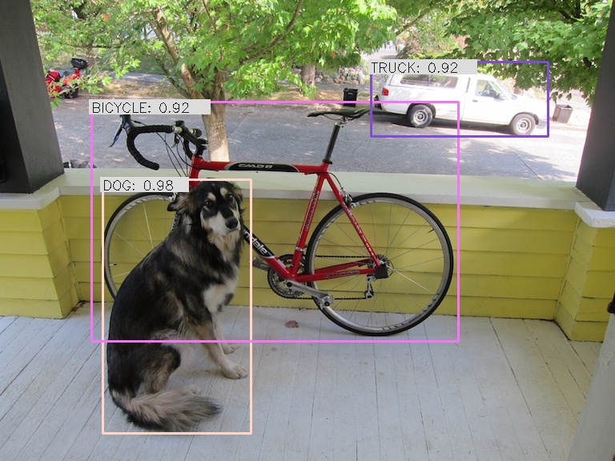

Get nvidia-pyindex to get access to the tritonclient packages:

```bash
pip install --user nvidia-pyindex
```

Create new conda environment:

```
conda env create -f environment.yml
conda activate yolov4-triton
```

Make sure triton server is running. Run the client:

```bash
python client.py image data/dog.jpg
```



Full features of this client:

```
usage: client.py [-h] [-m MODEL] [-u URL] [-o OUT] [-i] [-v]
                 [-t CLIENT_TIMEOUT] [-s] [-r ROOT_CERTIFICATES]
                 [-p PRIVATE_KEY] [-x CERTIFICATE_CHAIN]
                 {dummy,image,video} [input]

positional arguments:
  {dummy,image,video}   Run mode. 'dummy' will send an emtpy buffer to the
                        server to test if inference works. 'image' will
                        process an image. 'video' will process a video.
  input                 Input file to load from in image or video mode

optional arguments:
  -h, --help            show this help message and exit
  -m MODEL, --model MODEL
                        Inference model name. Default is yolov4.
  -u URL, --url URL     Inference server URL. Default is localhost:8001.
  -o OUT, --out OUT     Write output into file instead of displaying it.
  -i, --model-info      Print model status, configuration and statistics
  -v, --verbose         Enable verbose client output
  -t CLIENT_TIMEOUT, --client-timeout CLIENT_TIMEOUT
                        Client timeout in seconds. Default is None.
  -s, --ssl             Enable SSL encrypted channel to the server
  -r ROOT_CERTIFICATES, --root-certificates ROOT_CERTIFICATES
                        File holding PEM-encoded root certificates. Default is
                        None.
  -p PRIVATE_KEY, --private-key PRIVATE_KEY
                        File holding PEM-encoded private key. Default is None.
  -x CERTIFICATE_CHAIN, --certificate-chain CERTIFICATE_CHAIN
                        File holding PEM-encoded certicate chain. Default is
                        None.
```
